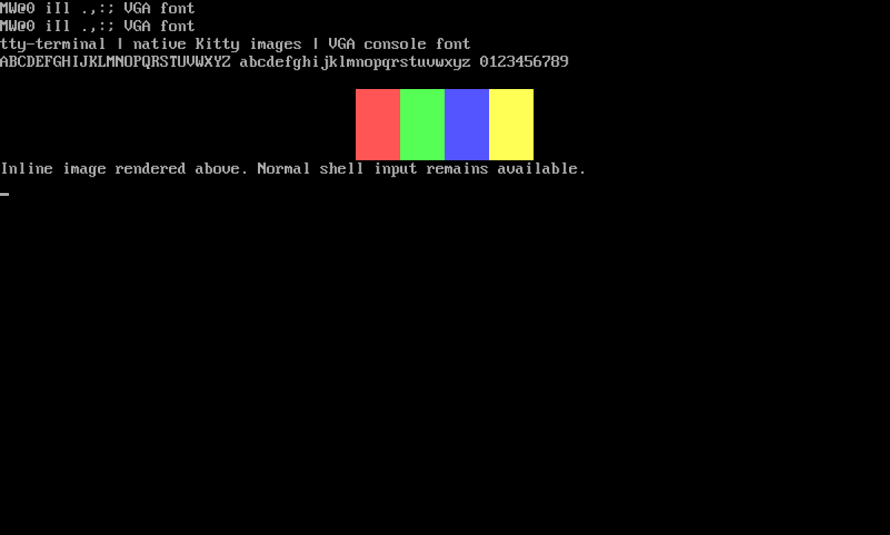

this is all vibecoded as fuck i dont know how it works. use at your own risk 👍

# tty-terminal

A Linux console-styled frontend to [Kitty](https://sw.kovidgoyal.net/kitty/).
Classic VGA glyphs and colors, with a desktop terminal's clipboard, scrollback,
and native inline images.



- Black background, console font, no synthetic bold, optional window decorations.
- Startup size in rows/columns, fullscreen toggle, and adjustable font height.
- Native Kitty graphics: `kitten icat /path/to/image.png`.
- TOML preferences, with command-line overrides.
- Uses your account's shell and its existing startup configuration.

This is a Kitty frontend, not a kernel TTY or an independent terminal engine.
Font rendering can vary with DPI and fractional display scaling. The tested
runtime is Kitty 0.48.2 on CachyOS, on Wayland and XWayland. The application uses
Kitty's Python interfaces; new Kitty releases may need compatibility testing.

## Requirements

Linux, Python 3.11+, Kitty 0.48.2+, Fontconfig, and a graphics environment
supported by Kitty. Building the font additionally needs Python FontTools and
Make. `desktop-file-utils` is used by the checks.

On Arch/CachyOS:

```sh
sudo pacman -S --needed kitty python python-fonttools fontconfig make desktop-file-utils
make check
```

## Install

For a personal development installation from this checkout:

```sh
bash install.sh
~/.local/bin/tty-terminal
```

Keep the checkout in place: the personal launcher links to it. For a system
installation:

```sh
make
sudo make PREFIX=/usr/local install
```

The desktop application is **tty-terminal** (older personal installations may
still display **TTY Terminal**). An Arch package installs to `/usr` and is
managed by pacman. The AUR submission is prepared but not yet published; see
[distribution and release instructions](docs/DISTRIBUTION.md).

Package installation does not write to users' home directories. To customize:

```sh
mkdir -p ~/.config/tty-terminal
cp -n /usr/share/tty-terminal/config.example.toml ~/.config/tty-terminal/config.toml
```

For a `/usr/local` installation, use `/usr/local/share/tty-terminal/` instead.
The personal installer creates the config only when it does not exist.

## Configuration

Edit `~/.config/tty-terminal/config.toml` and reopen the terminal. If
`XDG_CONFIG_HOME` is set, it is used instead of `~/.config`.

```toml
columns = 100
rows = 30
fullscreen = false
decorated = false
font_size = 16
scrollback_lines = 10000
cursor_shape = "underline"
cursor_blink = true
audible_bell = false
directory = ""
```

- `columns` and `rows`: 2–1000; initial windowed dimensions. Fullscreen fills
  the monitor. The window manager can constrain oversized windows.
- `font_size`: integer height in logical pixels, 8–64. For example, 20 or 24.
  Multiples of 16 preserve the source bitmap's proportions most closely.
- `scrollback_lines`: 0–1000000; zero disables history.
- `cursor_shape`: `underline`, `block`, or `ibeam`.
- `directory`: empty inherits the launch directory; `"~"` starts in your home.

Missing settings use defaults. Invalid or unknown settings produce an error.
Kitty's normal user configuration is bypassed so it does not change this theme.
Applications inside the terminal can still change their own colors and cursor.

```sh
tty-terminal --windowed --columns 100 --rows 30
tty-terminal --font-size 24
tty-terminal --fullscreen
tty-terminal --directory ~/Projects
tty-terminal --config ~/another-terminal.toml
tty-terminal -e /bin/bash --noprofile --norc
tty-terminal --version
```

Everything after `-e` belongs to the child command. A custom shell prompt or
Fastfetch startup banner is supplied by your shell configuration, not this app.

## Controls

| Key | Action |
| --- | --- |
| F11 | Toggle fullscreen |
| Ctrl+Shift+C / V | Copy / paste |
| Ctrl+Shift+Plus / Minus | Change font height by one logical pixel |
| Shift+PageUp / PageDown | Scroll history |
| Ctrl+Shift+Q | Close the terminal |
| `exit` or Ctrl+D | Exit the shell normally |

On KDE, Meta+drag moves a borderless window. Standard terminal keys, such as
Ctrl+C, go to the shell or application. Interactive zoom changes the current
session; edit `font_size` to save your preferred startup size.

## Images

```sh
kitten icat /path/to/image.png
```

Use the Kitty backend in image-capable file managers and other terminal apps.
`TERM=xterm-kitty` describes the engine's capabilities; Fastfetch identifies the
process as `tty-terminal`. The installed package uses the system Kitty/kitten.

## AppImage

The existing experimental AppImage is built from CachyOS libraries and requires
**x86-64-v3 and Linux 6.1+**. It is not advertised as a universal Linux release.
It bundles Kitty, Python, the font, and runtime libraries. The destination
machine still supplies its graphics drivers, shell, and shell configuration.

A neighboring folder named exactly `<AppImage filename>.config` carries portable
settings; put `tty-terminal/config.toml` inside it. Without that folder, normal
user config is used. Use `--appimage-extract-and-run` if FUSE is unavailable.

The public workflow currently publishes source archives only. See
[AppImage release requirements](docs/DISTRIBUTION.md#recommended-formats)
before distributing the local experimental binary.

## Development and verification

```sh
make check
make DESTDIR="$PWD/build/stage" PREFIX=/usr install
python3 build/stage/usr/share/tty-terminal/tty_terminal.py --version
```

The font build is deterministic and uses the bundled glyph source and Unicode
mapping; kbd and network access are not required. Unit checks cover preferences,
command-line precedence, validation, and font metrics/reproducibility.

Interactive checks require a graphical session, Fastfetch, and the installed
Kitty engine. They briefly open a window:

```sh
python3 test_terminal.py
python3 test_terminal.py /path/to/tty-terminal.AppImage
```

These exercise the Kitty graphics query, PNG transfer, starting dimensions,
Fastfetch name, and shell environment. `test_visual.py` additionally allows a
window-specific XWayland screenshot using ImageMagick. These GUI checks are not
run by headless CI.

## License

Original code and packaging: [MIT](LICENSE). The VGA font, its glyph source, and
Unicode mapping: [GPL-2.0-only](assets/FONT-LICENSE.txt).
See [third-party notices](THIRD_PARTY.md). Kitty is an external GPL-3.0-only
runtime dependency of the native package.
